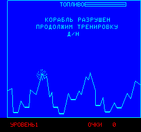

Lunar Mission
=============

Tape cover
==========

Files
=====
lunarmission.bas is the Oric original source.

luna.bas is the Russian language adaptation made for Pravetz-8D by "Lvov Programma".

Screenshots
===========

